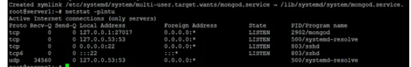
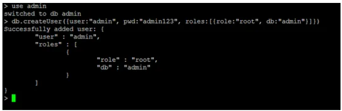
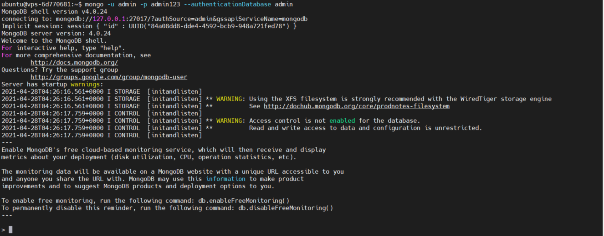

# instaleretconfigurermongodbsurvps
Installation et configuration d'un serveur de base de donnée MongoDB sur un serveur linux 
## Conditions préalables
* Ubuntu Serveur 18.04 - 64 bit
* Avoir les privilèges **Root**
  
## Ce que nous allons faire dans ce tutoriel:
* Installer MongoDB
* Configurer MongoDB
* Conclusion
  
  ## Installez MongoDB sur Ubuntu 18.04 LTS
  ### Étape 1 - Importation de la clé publique
  Les clés GPG du distributeur de logiciels sont requises par le gestionnaire de packages Ubuntu apt (Advanced Package Tool) pour garantir la cohérence et l'authenticité du package. Exécutez cette commande pour importer les clés MongoDB sur votre serveur.
  <code>
    <pre>
        sudo apt-key adv --keyserver hkp://keyserver.ubuntu.com:80 --recv 68818C72E52529D4
    </pre>
  </code>

  ### Step 2 - Create source list file MongoDB
   Créez un fichier de liste MongoDB dans /etc/apt/sources.list.d/ avec cette commande:
   <code>
    <pre>
        sudo echo "deb http://repo.mongodb.org/apt/ubuntu bionic/mongodb-org/4.0 multiverse" | sudo tee /etc/apt/sources.list.d/mongodb-org-4.0.list
    </pre>
  </code>

### Étape 3 - Mettez à jour le référentiel
mettre à jour le référentiel avec la commande apt:
<code>
    <pre>
        sudo apt-get install -y mongodb-org
    </pre>
</code>

 ### Étape 4 - Installez MongoDB
 Vous pouvez maintenant installer MongoDB en tapant cette commande:
 <code>
    <pre>
        sudo apt-get install -y mongodb-org
    </pre>
</code>

Le programme d'installation d'**apt MongoDB** a créé automatiquement un fichier **mongod.service** pour **Systemd**, il n'est donc plus nécessaire de le créer manuellement.

Démarrez **MongoDB** et ajoutez-le en tant que service à démarrer au démarrage:
<code>
    <pre>
        sudo systemctl start mongod
        sudo systemctl enable mongod
    </pre>
</code>

Vérifiez maintenant que MongoDB a été démarré sur le port 27017 avec la commande netstat.

<code>
    <pre>
        sudo netstat -plntu
    </pre>
</code>

## Configurer le nom d'utilisateur et le mot de passe MongoDB
### Étape 1 - Ouvrez la coque mongo
Avant de configurer un nom d'utilisateur et un mot de passe pour MongoDB, vous devez ouvrir le shell MongoDB sur votre serveur. Vous pouvez vous connecter en tapant:

<code>
    <pre>
        mongo
    </pre>
</code>

Si vous obtenez une erreur Échec de l'initialisation globale: BadValue Non valide ou aucun paramètre régional utilisateur n'est défini. Veuillez vous assurer que les variables d'environnement LANG et / ou LC_ * sont correctement définies, essayez la commande:

<code>
    <pre>
        export LC_ALL=C
        mongo 
    </pre>
</code>

### Étape 2 - Basculez vers l'administrateur de la base de données
Une fois que vous êtes dans le shell MongoDB, passez à la base de données nommée admin:

<code>
    <pre>
        use admin
    </pre>
</code>

### Étape 3 - Créez l'utilisateur root
Créez l'utilisateur root avec cette commande:

<code>
    <pre>
        db.createUser({user:"admin", pwd:"admin123", roles:[{role:"root", db:"admin"}]})
    </pre>
</code>

Desc: crée l'utilisateur **admin** avec le mot de passe **admin123** et avoir l'autorisation rôle en tant que **root** de la base de données est **admin**.

Tapez maintenant <code>exit</code> pour quitter le shell MongoDB.

<code>
    <pre>
        exit
    </pre>
</code>

Et vous êtes de retour sur le shell de Linux.

### Étape 4 - Activez l'authentification MongoDB
Modifiez le fichier de service mongodb **'/lib/systemd/system/mongod.service'** avec votre éditeur.

<code>
    <pre>
        sudo nano /lib/systemd/system/mongod.service
    </pre>
</code>

A la ligne 9 **ExecStart**, ajoutez la nouvelle option **--auth**.

<code>
    <pre>
        ExecStart=/usr/bin/mongod --auth --config /etc/mongod.conf
    </pre>
</code>

Enregistrez le fichier de service et quittez nano.

Rechargez le **service systemd**:

<code>
    <pre>
        sudo systemctl daemon-reload
    </pre>
</code>

### Étape 5 - Redémarrez MongoDB et essayez de vous connecter

Redémarrez maintenant MongoDB et connectez-vous avec l'utilisateur créé.

<code>
    <pre>
        sudo service mongod restart
    </pre>
</code>

et connectez-vous au shell MongoDB avec cette commande:

<code>
    <pre>
        mongo -u admin -p admin123 --authenticationDatabase admin
    </pre>
</code>

et vous verrez la sortie comme ceci:
